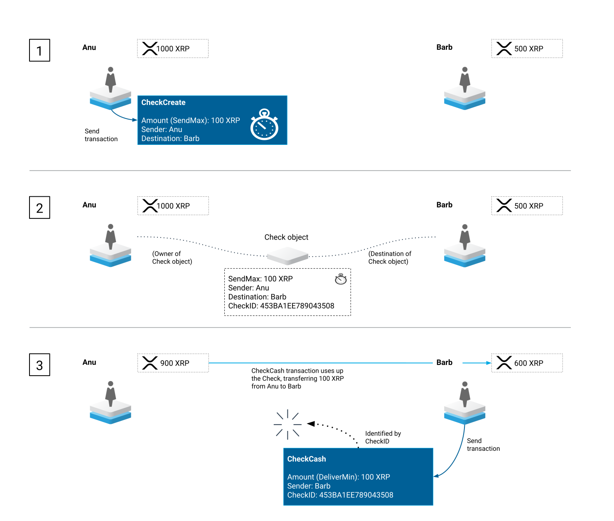
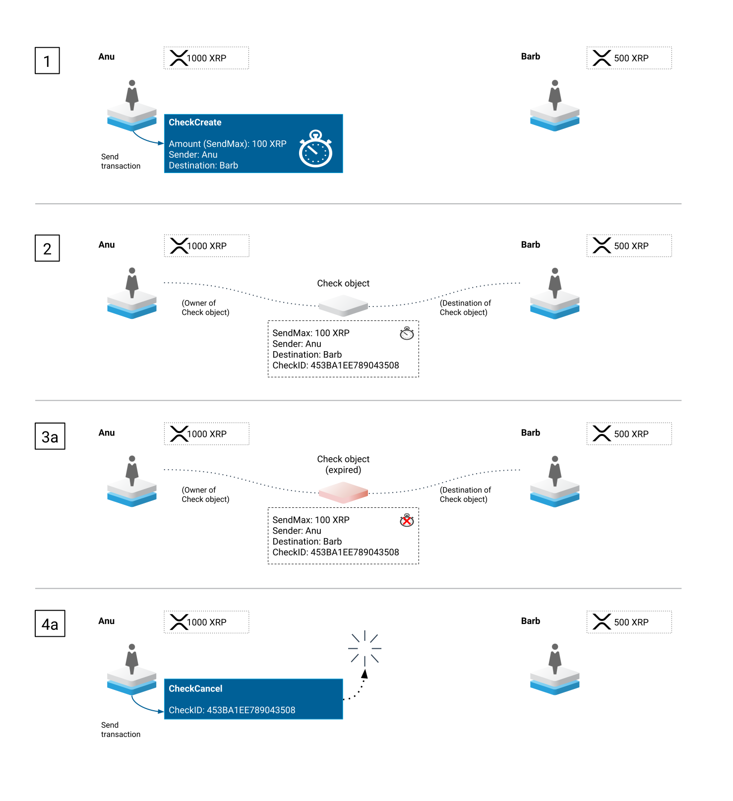

# 수표 (Checks)

XRP Ledger의 Checks 기능은 사용자가 받는 사람에게 취소하거나 현금화할 수 있는 지연된 결제를 만드는 것을 가능하게 합니다. 개인용 종이 수표와 같이, XRP Ledger의 Checks는 자금을 보내는 사람이 금액과 수령인을 지정하는 Check를 만드는 것으로 시작합니다. 수령인은 자신의 계정으로 보낸 자금을 끌어들이기 위해 수표를 현금화합니다. 받는 사람이 수표를 현금화하기 전까지 돈은 이동하지 않습니다. 수표를 만들 때 자금을 보류하지 않기 때문에, 보낸 사람이 받는 사람이 그것을 현금화하려고 할 때 충분한 자금이 없다면 수표를 현금화하는 것이 실패할 수 있습니다. 수표 현금화가 실패하면, 수표의 수신자는 수표가 만료될 때까지 재시도할 수 있습니다.

XRP Ledger Checks에는 더 이상 현금화할 수 없는 만료 시간이 있을 수 있습니다. 수신자가 만료 전에 성공적으로 수표를 현금화하지 못하면, 수표는 더 이상 현금화할 수 없지만, XRP Ledger에 객체가 남아 있습니다. 누구든지 만료 후에 수표를 취소할 수 있습니다. 만료 전에는 보낸 사람과 받는 사람만 수표를 취소할 수 있습니다. 보낸 사람이 성공적으로 수표를 현금화하거나 누군가가 그것을 취소하면 수표 객체는 Ledger에서 제거됩니다.

Checks는 [Escrow](https://xrpl.org/escrow.html)와 [Payment Channels](https://xrpl.org/use-payment-channels.html)와 일부 유사성이 있지만, 이러한 기능과 Checks 사이에는 몇 가지 중요한 차이점이 있습니다:

- Checks로 [토큰](https://xrpl.org/tokens.html)을 보낼 수 있습니다. Payment Channels와 Escrow로는 XRP만 보낼 수 있습니다.
- Checks는 어떤 자금도 잠그거나 예약하지 않습니다. Payment Channels와 Escrow에 관련된 XRP는 보낸 사람이 제공한 청구에 의해 (Payment Channels) 현금화되거나, 만료나 암호 조건에 의해 (Escrow) 해제될 때까지 사용할 수 없습니다.
- Escrow를 통해 자신에게 XRP를 보낼 수 있습니다. 자신에게 Checks를 보낼 수는 없습니다.

## Checks의 목적

전통적인 종이 수표는 사람들이 실제 통화를 즉시 교환하지 않고도 자금을 이체할 수 있게 해줍니다. XRP Ledger Checks는 사람들이 은행 업계에서 익숙하게 받아들여지는 과정을 사용하여 비동기적으로 자금을 교환할 수 있게 합니다.

XRP Ledger Checks는 또한 XRP Ledger에 고유한 문제를 해결합니다: 사용자가 원치 않는 결제를 거부하거나 결제의 일부만을 수락할 수 있게 합니다. 이는 컴플라이언스 이유로 결제를 신중하게 받아야 하는 기관들에게 유용합니다.

### 사용 사례: 결제 승인

**문제:** [BSA, KYC, AML, and CFT](https://xrpl.org/become-an-xrp-ledger-gateway.html#compliance-guidelines)와 같은 규정을 준수하기 위해, 금융 기관은 받은 자금의 출처에 대한 문서를 제공해야 합니다. 이러한 규정은 기관이 그들이 처리하는 모든 결제의 출처와 목적지를 알아야 하도록 하여 불법적인 자금 이체를 방지하려고 합니다. XRP Ledger의 성질로 인해, 누구든지 원하는 경우 XRP (그리고 특정 조건 하에서 토큰)를 기관의 XRP Ledger 계정으로 보낼 수 있습니다. 이러한 원치 않는 결제를 처리하는 것은 이러한 기관의 컴플라이언스 부서에 상당한 비용과 시간 지연을 추가하며, 잠재적으로 벌금이나 제재를 포함할 수 있습니다.

**해결책:** 기관은 [AccountSet 트랜잭션에서 `asfDepositAuth` 플래그를 설정](https://xrpl.org/accountset.html)하여 그들의 XRP Ledger 계정에 [Deposit Authorization](https://xrpl.org/depositauth.html)을 활성화할 수 있습니다. 이것은 계정이 결제 트랜잭션을 받을 수 없게 만듭니다. Deposit Authorization이 활성화된 계정은 오직 Escrow, Payment Channels, 또는 Checks를 통해서만 자금을 받을 수 있습니다. Deposit Authorization이 활성화된 경우, Checks는 자금을 이체하는 가장 간단하고 친숙하며 유연한 방법입니다.

## 사용법

XRP Ledger의 Checks는 아래 그림과 같은 생애주기를 보통 가집니다.



**단계 1:** 체크를 생성하기 위해, 발신자는 [CheckCreate][] 트랜잭션을 제출하고 수신자(`Destination`), 만료 시간(`Expiration`), 그리고 발신자 계정에서 인출될 수 있는 최대 금액(`SendMax`)을 지정합니다.

**단계 2:** CheckCreate 트랜잭션이 처리된 후, XRP Ledger 상에 [Check 객체](https://xrpl.org/check.html)가 생성됩니다. 이 객체는 그것을 생성한 트랜잭션에 의해 정의된 체크의 속성을 포함합니다. 이 객체는 만료 시간이 지나기 전에 발신자(체크를 [CheckCancel][] 트랜잭션으로 취소하는 경우) 또는 수신자(체크를 취소하거나 현금화하는 경우)에 의해서만 변경될 수 있습니다. 만료 시간이 지난 후에는 누구든지 체크를 취소할 수 있습니다.

**단계 3:** 체크를 현금화하기 위해, 수신자는 [CheckCash][] 트랜잭션을 제출합니다. 수신자는 체크를 현금화하는 두 가지 옵션이 있습니다:

- `Amount` — 수신자는 이 옵션을 사용하여 현금화할 정확한 금액을 지정할 수 있습니다. 이는 발신자가 가능한 [이체 수수료](https://xrpl.org/transfer-fees.html)를 커버하기 위해 체크를 패딩하고 수신자가 송장이나 다른 계약에 명시된 정확한 금액을 받아들이기 원하는 경우에 유용할 수 있습니다.

- `DeliverMin` — 수신자는 이 옵션을 사용하여 체크에서 받을 최소 금액을 지정할 수 있습니다. 수신자가 이 옵션을 사용하면, XRP Ledger는 가능한 많이 전달하려고 시도하고 항상 적어도 이 금액을 전달합니다. 수신자에게 입금될 수 있는 금액이 요청한 금액 이상이 아니라면, 트랜잭션은 실패합니다.

발신자가 체크를 커버할 충분한 자금을 가지고 있고 만료 시간이 아직 지나지 않았다면, 자금은 발신자의 계정에서 차감되고 수신자의 계정으로 입금되며, 체크 객체는 파괴됩니다.

### 만료 경우

만료의 경우, 체크는 아래 그림과 같은 생애주기를 가집니다.



모든 체크는 동일한 방식으로 시작하므로 **단계 1과 2**는 동일합니다.

**단계 3a:** 수신자가 체크를 현금화하기 전에 체크가 만료된 경우, 체크는 더 이상 현금화될 수 없지만 객체는 Ledger에 남아 있습니다.

**단계 4a:** 체크가 만료된 후에는 누구든지 [CheckCancel][] 트랜잭션을 제출하여 취소할 수 있습니다. 그 트랜잭션은 체크를 Ledger에서 제거합니다.

## 체크의 JSON 표현

체크의 JSON 표현은 다음과 같습니다:

```json
{
  "Account": "rf1BiGeXwwQoi8Z2ueFYTEXSwuJYfV2Jpn",
  "TransactionType": "CheckCreate",
  "Fee": "12",
  "SendMax": "100000000",
  "Destination": "ra5nK24KXen9AHvsdFTKHSANinZseWnPcX",
  "Expiration": 570113521,
  "InvoiceID": "46060241FABCF692D4D934BA2A6C442898318206E51EDE1F824F300A",
  "DestinationTag": 1,
  "Sequence": 2
}
```

이 JSON 코드는 XRP Ledger에서 Check를 생성하는 `TransactionType인` `CheckCreate`를 사용하고 있습니다. `Account`는 체크를 만드는 계정을, `Destination`은 체크를 받는 계정을 나타냅니다. `SendMax`는 체크에서 인출할 수 있는 최대 금액을 나타냅니다. `Expiration`은 체크가 만료되는 시간을 나타내며, 이 시간 이후로는 체크를 인출할 수 없습니다. `InvoiceID`는 체크와 연결된 송장의 ID를, `DestinationTag`는 목적지 계정에 대한 추가 정보를 나타냅니다. `Sequence`는 해당 계정에서 몇 번째 트랜잭션인지를 나타냅니다.

## 체크 관련 트랜잭션 타입

체크와 관련된 트랜잭션은 세 가지 타입이 있습니다: `CheckCreate`, `CheckCash`, `CheckCancel`. 각 트랜잭션 타입의 사용 방법과 주의 사항에 대해 자세히 알아봅시다.

### CheckCreate

`CheckCreate` 트랜잭션을 사용하면 체크를 만들 수 있습니다. 체크를 만들기 위해서는 다음과 같은 정보가 필요합니다:

- `Account` : 체크를 만드는 계정의 주소입니다.
- `Destination` : 체크를 받는 계정의 주소입니다.
- `SendMax` : 체크에서 인출할 수 있는 최대 금액입니다. 이 금액은 XRP 또는 특정 통화로 지정할 수 있습니다.
- `Expiration` (선택사항) : 체크가 만료되는 시간을 나타내는 [리플 타임스탬프](https://xrpl.org/basic-data-types.html#specifying-time)입니다.
- `InvoiceID` (선택사항) : 체크와 연결된 송장의 ID입니다.
- `SourceTag` (선택사항) : 원본 계정에 대한 추가 정보를 나타내는 숫자입니다.
- `DestinationTag` (선택사항) : 목적지 계정에 대한 추가 정보를 나타내는 숫자입니다.

### CheckCash

`CheckCash` 트랜잭션을 사용하면 체크를 현금화할 수 있습니다. 체크를 현금화하기 위해서는 다음과 같은 정보가 필요합니다:

- `Account` : 체크를 현금화하는 계정의 주소입니다. 이 계정은 체크의 수취인이어야 합니다.
- `CheckID` : 현금화할 체크의 ID입니다.
- `Amount` (선택사항) : 체크에서 인출하려는 금액입니다. 이 필드를 지정하지 않으면 `DeliverMin` 필드를 지정해야 합니다.
- `DeliverMin` (선택사항) : 체크에서 받아들일 최소 금액입니다. 이 필드를 지정하지 않으면 `Amount` 필드를 지정해야 합니다.

### CheckCancel

`CheckCancel` 트랜잭션을 사용하면 체크를 취소할 수 있습니다. 체크를 취소하기 위해서는 다음과 같은 정보가 필요합니다:

- `Account` : 체크를 취소하는 계정의 주소입니다. 이 계정은 체크의 송신자이거나 만료된 체크의 수취인이어야 합니다.
- `CheckID` : 취소할 체크의 ID입니다.

## 코드 구현

XRP Ledger에서 Check를 사용하는 시나리오를 다음과 같이 가정하여 코드로 구현해보겠습니다.

1. Alice는 Bob에게 50 XRP를 보낼 수표를 생성합니다.
2. Alice는 수표를 XRPL에 전송합니다.
3. a. Bob은 수표를 확인하고 현금으로 교환합니다.  
   b. Alice 또는 Bob이 수표를 취소합니다.

### 수표 생성

```python
from xrpl.models.transactions import CheckCreate
from xrpl.wallet import Wallet
from xrpl.clients import JsonRpcClient
from xrpl.transaction import (
    safe_sign_and_autofill_transaction,
    safe_sign_and_submit_transaction,
)

JSON_RPC_URL = "https://s.altnet.rippletest.net:51234"  # Ripple testnet JSON-RPC URL
alice_wallet = Wallet(seed="alice's seed", sequence=1)  # Alice's wallet
bob_address = "bob's address"  # Bob's address

client = JsonRpcClient(JSON_RPC_URL)

# Alice creates a check
check_create = CheckCreate(
    account=alice_wallet.classic_address,
    sequence=alice_wallet.sequence,
    destination=bob_address,
    send_max="50000000",  # 50 XRP
)

# Alice signs and submits the CheckCreate transaction
response = safe_sign_and_submit_transaction(check_create, alice_wallet, client)

print(response.result["engine_result"])  # Output: tesSUCCESS
```

### 수표 현금화

```python
from xrpl.models.transactions import CheckCash
from xrpl.core.binarycodec import encode_for_signing_check_cash

bob_wallet = Wallet(seed="bob's seed", sequence=1)  # Bob's wallet
check_id = response.result["hash"]  # Check's ID

# Bob cashes the check
check_cash = CheckCash(
    account=bob_wallet.classic_address,
    sequence=bob_wallet.sequence,
    check_id=check_id,
    amount="50000000",  # 50 XRP
)

# Bob signs and submits the CheckCash transaction
response = safe_sign_and_submit_transaction(check_cash, bob_wallet, client)

print(response.result["engine_result"])  # Output: tesSUCCESS
```

### 수표 취소

```python
from xrpl.models.transactions import CheckCancel

# Alice cancels the check
check_cancel = CheckCancel(
    account=alice_wallet.classic_address,
    sequence=alice_wallet.sequence,
    check_id=check_id,  # ID of the check to be cancelled
)

# Alice signs and submits the CheckCancel transaction
response = safe_sign_and_submit_transaction(check_cancel, alice_wallet, client)

print(response.result["engine_result"])  # Output: tesSUCCESS
```
